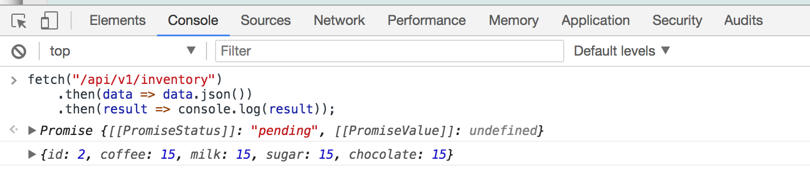
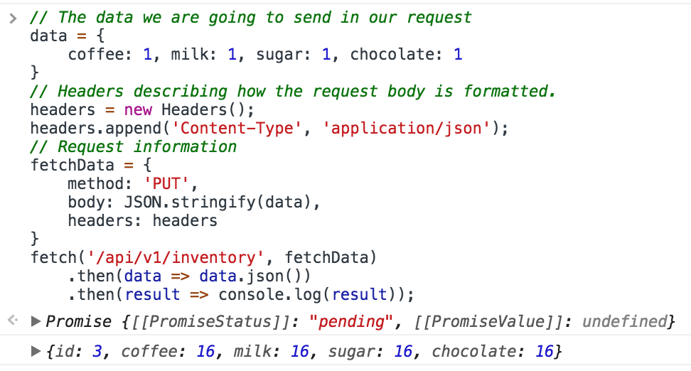

# Introduction

A *RESTful architecture*, is an architectural style ([Fielding](https://www.ics.uci.edu/~fielding/pubs/dissertation/top.htm)) for providing resources to clients using a set of request verbs and resource locations. A REST API allows a client to access resources provided by a service.

In this workshop, you will learn the concepts associated with REST APIs, practice accessing an existing REST api as a client, and implement a REST service.

We have made a simple version of CoffeeMaker, called CoffeeMaker-Lite, with only the Spring REST API (no database or front-end). Clone this repository and import the CoffeeMaker-Lite project as an existing Maven project.  Start CoffeeMaker-Lite; CoffeeMaker-Lite runs the same as the normal one: Run As -> Maven Build ... -> Goals: `clean spring-boot:run`.

## Concepts

Simply put, an API (or Application Programming Interface) defines a specification for how to communicate with a computer program or subset thereof. An API lays out what functionality is offered, what parameters must be provided when making calls, and provides some guarantees about the return type given the preconditions are satisfied. Fundamentally, a complete and well-documented API makes it easier to use a piece of code as a “building block” for building a larger system.

A REST API is a subtype of API that is geared towards Internet-facing systems. The goal of REST APIs is to provide painless communication and interoperability between these Internet-facing applications and systems. REST APIs typically allow (often with some sort of authentication) a manipulation of the various types of entities (recipes, inventory, etc) that a web application revolves around.

The key concept behind REST APIs is that they are inherently stateless, that is, everything that a server needs to know to complete a request or a client needs to know about the results is contained within the request itself. This is contrary to the notion of a server maintaining a session where it stores information about a series of transactions with a particular client, or cookies where a client keeps similar information stored on its end.

REST APIs typically consume and produce JSON-formatted content. A successor to XML, JSON documents are easy for a computer to parse and easy for a human to read.

### Verbs

Typically, REST API operations are carried out over HTTP; consequently most REST API actions are based around HTTP verbs (POST, PUT, DELETE, and so on). The actions typically available are:

| HTTP Verb	| Action             |	Example	       |Result  | 
| --------- | ------------------ | --------------- |------- |
| GET	    | Retrieve record(s) | GET /users/	   | Retrieves all users|
| DELETE	| Delete record(s)	 | DELETE /users/1 | Deletes user with id 1|
| POST	    | Create record	     | POST /users/	   | Creates a new user|
| PUT	    | Update record	     | PUT /users/6	   | Updates user 6|

## Practicting with a REST Client

Let's see how a javascript client application can communicate with a server using a REST API call.

### Getting the inventory from inside the browser

Open the developer's tool console (in your Web browser -- not Eclipse!) and execute this code inside of the console.

```Javascript
fetch("/api/v1/inventory")
    .then(data => data.json())
    .then(result => console.log(result));
```

This constructs as simple `GET` request to `/api/v1/inventory` and retrieves the inventory as a JSON object. You should be able to see results as follows:



### Send a request to update inventory

We can also construct a request that uses the HTTP `PUT` verb, and sends a request body object to the server.
The following request will increase coffee, milk, sugar, and chocolate inventory count by 1.

```Javascript
// The data we are going to send in our request
data = {
    coffee: 1, milk: 1, sugar: 1, chocolate: 1
}
// Headers describing how the request body is formatted.
headers = new Headers();
headers.append('Content-Type', 'application/json');
// Request information
fetchData = { 
    method: 'PUT', 
    body: JSON.stringify(data),
    headers: headers
}
fetch('/api/v1/inventory', fetchData)
    .then(data => data.json())
    .then(result => console.log(result));
```

Executing this code snippet in the browser would increase the all items in inventory by 1.  
**Note that this isn't actually working yet -- one of your tasks is to implement it*.*  



### Running from a command line

Using curl to access the REST API from your system. Here are the same examples, but written to work with curl:

```bash
curl --request GET http://localhost:8080/api/v1/inventory
```

```bash
curl --request PUT -H "Content-Type: application/json" --data '{"coffee":1,"milk":1,"sugar":1,"chocolate":1}' http://localhost:8080/api/v1/inventory
```

As above, this won't work until you implement the PUT route.

### API tools

Although debugging from the browser console window or with command line tools can be useful, investing in web traffic/API tools will be worthwhile. Here are two tools popular, which are frequently used in industry:

* [Postman](https://www.getpostman.com/postman)
* [Fiddler](https://www.telerik.com/fiddler)


## Providing a REST service with Spring

Fortunately, Spring makes it extremely simple to write REST APIs.  In Spring, _any_ class can be a "REST controller", responding to REST API requests.  The only requirement is that any such class must have a `@RestController` annotation on the class itself, such as [CoffeeMaker's `RESTAPIController`](https://github.ncsu.edu/engr-csc326-staff/Onboarding/blob/master/CoffeeMaker/src/main/java/edu/ncsu/csc/coffee_maker/controllers/RESTAPIController.java):
```
@RestController
@SuppressWarnings ( { "unchecked", "rawtypes" } )
public class RESTAPIController {
    ...
}
```

Within an annotated class, individual methods must be annotated as well.  First, the method must have an annotation indicating _which_ type of REST request it will respond to.  For instance,
```
@DeleteMapping ( BASE_PATH + "/recipes/{id}" )
public ResponseEntity deleteRecipe ( @PathVariable final String id ) {
	...
}
```
indicates via annotation that the method will respond only to DELETE requests.  The Spring framework will make sure of this automatically and will not route other requests to the controller.

Notice the presence of the `{id}` in the annotation and its re-occurrence in the parameter list of the method.  This specifies _which_ recipe it is that we're trying to delete.  In general, when trying to interact with a specific instance of an object, you'll need to specify this parameter (but you will _not_ when interacting with the entire collection, such as performing a `GET /recipes/` to retrieve all of them).

Exactly what path variable is used to interact with a REST API is up to the writer of the API, but should generally be the primary key of whatever the data type is.  For `Recipe`s in CoffeeMaker, this is a Long that is the `Recipe` `id`.  For other object types, this primary key might be a String that is the name of the object.  Use whatever makes sense and lets you unambiguously refer to the object in question (such as `username` when interacting with Users, but probably not `firstName`).

Additionally, notice the return type of the method above: Spring REST API methods will (typically) return a `ResponseEntity`, which is a Spring data structure that is automatically serialized to JSON when sent back to the client.  The one exception to this rule is that a "get all" (such as the `GET /recipes/` mentioned above) will return a `List` of the appropriate type, which will again automatically be serialized to JSON.

Within the method body itself, the developer is responsible for writing whatever code is necessary for retrieving, updating, or deleting the request that comes in.  For instance, in our CoffeeMaker "POST recipe" method, we see the following:

```
@PostMapping ( BASE_PATH + "/recipes" )
public ResponseEntity createRecipe ( @RequestBody final Recipe recipe ) {
    if ( null != Application.getCoffeeMaker().getRecipeBook().findRecipe( recipe.getName() ) ) {
    return new ResponseEntity( "Recipe with the name " + recipe.getName() + " already exists",
                HttpStatus.CONFLICT );
    }
    try {
        Application.getCoffeeMaker().getRecipeBook().addRecipe( recipe );
        return new ResponseEntity( recipe, HttpStatus.OK );
    }
    catch ( final Exception e ) {
        return new ResponseEntity( "Insufficient space in recipe book for recipe " + recipe.getName(),
                HttpStatus.INSUFFICIENT_STORAGE );
    }

}
```

Here, we must perform some validation to make sure that the recipe does not already exist and that space exists for it.  Then, we create and return a `ResponseEntity` with the result.  Spring's `ResponseEntity` is a _very_ flexible structure whose constructor takes two parameters: the response body to be returned to the user (a String indicating an error message, or any other Object that was retrieved) and a [HTTP status](https://en.wikipedia.org/wiki/List_of_HTTP_status_codes) indicating the status of the request.

### Testing a REST service

Spring provides several ways to test a REST endpoint. One useful way is to create an integration test that will allow you to simulate a client call to an endpoint.

To create the Test class, you first annotate the class as follows.

```java
@RunWith ( SpringRunner.class )
@SpringBootTest ( properties = "logging.level.org.springframework.web=DEBUG" )
@AutoConfigureMockMvc
public class APITest {
```

Then you can write a unit test as follows:

```java
    @Test 
    public void getExistingOrder() throws Exception {
        mvc.perform( get( "/api/v1/orders/1" ) )
        .andExpect( status().isOk() )
        .andExpect( jsonPath("$.orderNumber", is(1) ) )
        .andExpect( jsonPath("$.coffee", is(1) ) )
        .andExpect( jsonPath("$.milk", is(0) ) );
    }
```

> **Note**: That the full path will be `/api/v1/orders/1` when using as a client.

### Practice Creating a Spring REST API endpoint.

The CoffeeMaker-Lite project has a working REST call for returning `GET /inventory`. It also has a "order" history service, that tracks the updates to the inventory. However, the code is missing two REST endpoints: a) updating inventory, and b) getting an a specific order by id.

1. From eclipse, run the Maven test goal, or from a command line, inside the CoffeeMaker-Lite directory, run `mvn test`.

   Observe 2 tests failing:

   ```
   Failed tests: 
   APITest.getExistingOrder:100 Status expected:<200> but was:<404>
   APITest.testPut:84 Status expected:<200> but was:<405>
   ```

Let's update the edu.ncsu.csc.coffee_maker.controller.RESTAPIController.java class to provide the proper endpoints that will pass the test.

2. Create a `PUT /inventory` endpoint that will call `inventoryService.addInventory( inventory )` and will return the current Inventory (`inventoryService.getInventory()`).

3. Create a `GET /orders/{id}` endpoint that will call `inventoryService.getOrders()`. Return the appropriate order object (based on index in list). Return 404 if index is out of range.

> Note: If you are getting stuck, see [Answers](Answer.md) for example implementations.

## CoffeeMaker: Add Edit Recipe REST API and tests.

Now you should be able to create a new Edit Recipe REST API endpoint inside CoffeeMaker and added the associated tests.
